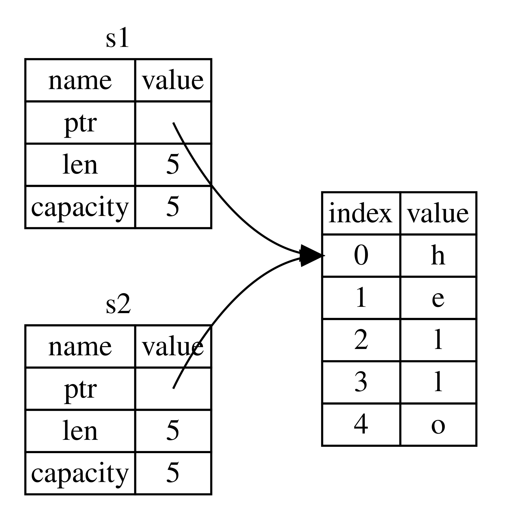
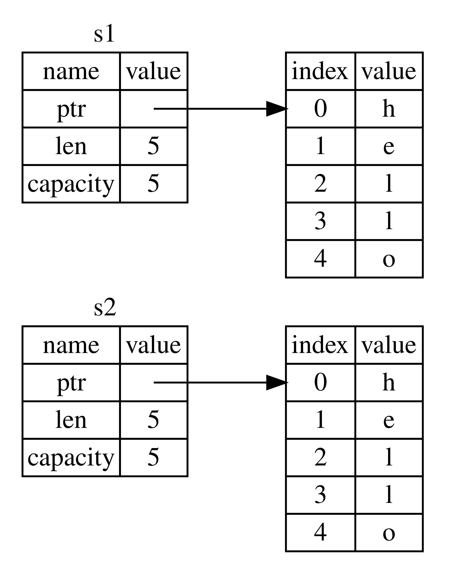

Ownership is a set of rules that compiler checks to ensure memory is safe throughtout the lifetime and govern how a Rust program manages memory. It enables Rust to make memory safety guarantees without needing a garbage collector.  
Keeping track of what parts of code are using what data on the heap, minimizing the amount of duplicate data on the heap, and cleaning up unused data on the heap so you don’t run out of space are all problems that ownership addresses.

## Stack vs Heap
>All data stored on the stack must have a known, fixed size. Data with an unknown size at compile time or a size that might change must be stored on the heap instead
>
>When you put data on the heap, you request a certain amount of space. The *memory allocator* finds an empty spot in the heap that is big enough, marks it as being in use, and returns a pointer (this is a big work compared to stack). Allocating on the heap and is abbreviated as just allocating (pushing values onto the stack is not considered allocating), and 
>
>Because the pointer to the heap is known, fixed size, *you can store the pointer on the stack*, but when you want the actual data, you must follow the pointer (must dive into the heap)
>
>Pushing to the stack is faster than allocating on the heap because the allocator never has to search for a place to store new data; that location is always at the top of the stack
>
>Accessing data in the heap is slower than accessing data on the stack because you have to follow a pointer to get there. Contemporary processors are faster if they jump around less in memory. Continuing the analogy, consider a server at a restaurant taking orders from many tables. It’s most efficient to get all the orders at one table before moving on to the next table. Taking an order from table A, then an order from table B, then one from A again, and then one from B again would be a much slower process. By the same token, a processor can do its job better if it works on data that’s close to other data (as it is on the stack) rather than farther away (as it can be on the heap).

# Ownership Rules
- Each value in Rust has an owner.  
- There can only be one owner at a time.  
- When the owner goes out of scope, the value will be dropped.

### String types
Unlike other basic datatypes (which are stored in stack, because of its fixed size), strings are stored in heap.

String literals cannot be used everywhere as much as String, because-
- string literals are `Immutable` and is of `fixed size`
- cannot take user input at runtime *(in this situation allocator will need to allocate the heap memory at the runtime)*.

For those, Rust has a second string type, **String**. This type manages data allocated on the heap and stores the data at compile time. 

Converting a string literal to String using the `String::from` function:
```rs
let s = String::from("hello");
```


><u>***From the docs***</u>:  
>## Examples
>You can create a String from a literal string with `[String::from]`:
>
>```rs
>let hello = String::from("Hello, world!");
>```
>You can append a `char` to a String with the `[push]` method, and append a `[&str]` with the `[push_str]` method:
>
>```rs
>let mut hello = String::from("Hello, ");
>hello.push('w'); // char are stored within ''(single quote)
>hello.push_str("orld!"); // str(string literals) are stored within ""(double quote)
>```
>If you have a vector of UTF-8 bytes, you can create a String from it with the `[from_utf8]` method:
>```rs
>// some bytes, in a vector
>let sparkle_heart = vec![240, 159, 146, 150];
>
>// We know these bytes are valid, so we'll use `unwrap()`.
>let sparkle_heart = String::from_utf8(sparkle_heart).unwrap();
>
>assert_eq!("💖", sparkle_heart);
>```

><u>***From the docs***</u>:  
>
>The `str` type, also called a `'string slice'`, is the most primitive string type. It is usually seen in its borrowed form, `&str`. It is also the type of string literals, `&'static str`.
>### Basic Usage-
>**String literals are string slices-**
>```rs
>let hello_world = "Hello, World!";
>```
>Here we have declared a string slice initialized with a string literal. String literals have a static lifetime, which means the string hello_world is guaranteed to be valid for the duration of the entire program. We can explicitly specify hello_world's lifetime as well like below-  
>```rs
>let hello_world: &'static str = "Hello, world!";
>```
>
>#### String can be mutated but literals cannot-
>```rs
>let mut a :&str = "Aadarsh";
>a = "Atul" //OK, as we are just changing the reference `a` to point to a new string slice/string literal, but NOT modifying the underlying data
>
>a[0] = 'b'; //compile error (as we are trying to change underlying data here)
>
>```

#### Why are string literals immutable, while String are mutable- 
Main difference is when and where is the memory managed.  
- ***Case 1-*** String literal's size is fixed and is known at compile time, makes it fast and efficient which only comes because of its immutability property. Unfortunately, we can’t put a blob of memory into the binary for each piece of text whose size is unknown at compile time and whose size might change while running the program.
- ***Case 2***- With the String type, in order to support a mutability, we need to allocate an amount of memory on the heap, unknown at compile time, to hold the contents. This means:

    - The memory must be requested from the memory allocator at runtime.
    - We need a way of returning this memory to the allocator when we’re done with our String.

    The 1st part is done by us: when we call `String::from`, its implementation requests the memory it needs.
    The mistakes and blunders occurs while handling the 2nd part. If we forget to free/deallocate the memory the, we'll waste memory. If we do it too early we will have an invalid variable. If we do it twice, that's a bug.  
    We need to exactly pair one `allocate` with exactly one `free`.

    Rust takes a different path- the memory is automatically returned once the variable that owns it goes out of scope, using the special function called `drop`
    ```rs
    {
        let s = String::from("hello"); // s is valid from this point forward
        // do stuff with s
    }                                  // this scope is now over, and s is no
                                       // longer valid, Rust calls drop automatically at the closing curly bracket

    ```
    >Note: In **C++**, this pattern of deallocating resources at the end of an item’s lifetime is sometimes called **Resource Acquisition Is Initialization (RAII)** .

### Shallow copy(move in Rust)
Normal copy is done here, as Normal datatype's value(integer, bool, float, char etc) is fixed and is  know at compile time. Also these values will be pushed onto the stack

There’s no difference between "deep" and "shallow " copying here, as we are not interacting with heap memory, so calling `clone` wouldn’t do anything different from the usual "shallow" copying, and so, we can leave it out. Also the copies of actual values are quick to make here.
    
    // GO THROUGH IT LATER- 
    Rust has a special annotation called the Copy trait that we can place on types that are stored on the stack, as integers are (we’ll talk more about traits in Chapter 10). If a type implements the Copy trait, variables that use it do not move, but rather are trivially copied, making them still valid after assignment to another variable.

    Rust won’t let us annotate a type with Copy if the type, or any of its parts, has implemented the Drop trait. If the type needs something special to happen when the value goes out of scope and we add the Copy annotation to that type, we’ll get a compile-time error. To learn about how to add the Copy annotation to your type to implement the trait, see “Derivable Traits” in Appendix C.

    So, what types implement the Copy trait? You can check the documentation for the given type to be sure, but as a general rule, any group of simple scalar values can implement Copy, and nothing that requires allocation or is some form of resource can implement Copy. Here are some of the types that implement Copy:

    - All the integer types, such as u32.
    - The Boolean type, bool, with values true and false.
    - All the floating-point types, such as f64.
    - The character type, char.
    - Tuples, if they only contain types that also implement Copy. For example, (i32, i32) implements Copy, but (i32, String) does not.


##### Stack-Only Data: Copy
```rs
    let x = 5;
    let y = x; 

    //x is still valid and wasn’t moved into y
    println!("x = {}, y = {}", x, y); //x=5, y=5
```


<br>
<br>

With `String` ( memory stored on the heap ):
```rs
    let s1 = String::from("hello");
    let s2 = s1;
```
  

With `let s2 = s1;` a Shallow copy (copying the pointer value) is done, which is nothing but a reference to the String literal in the heap, hence `s2` will point to the same address in memory.  
BUT, the very well know problem here is, when `s1` and `s2` goes out of scope, both will try to `free` the same memory. This is known as a ``double free error``. Freeing memory twice can lead to memory corruption, which can potentially lead to security vulnerabilities

#### Rust's way to tackle the problem-
To ensure memory safety, after the line `let s2 = s1;` Rust considers `s1` as no longer valid. Therefore, Rust doesn’t need to free anything when `s1` goes out of scope.
```rs
    let s1 = String::from("hello");
    let s2 = s1; //move (shallow copy + invalidates s1)
    println!("{}, world!", s1); //invalid access 
```
Hence, in the above code `s1` is now invalid.
   We have heard the terms ***shallow copy*** and ***deep copy*** while working with other languages, the concept of copying the `pointer, length, and capacity` without copying the data probably sounds like making a ***shallow copy***.  
But because *Rust also invalidates the first variable*, instead of being called a shallow copy, it’s known as a `move`. In this example, we would say that `s1` was moved into `s2`

The problem is solved, now `Only s2` will `free` the memory, when it goes out of scope.
> **NOTE:** There’s a design choice that’s implied by this: Rust will never automatically create “deep” copies of your data. Therefore, any automatic copying can be assumed to be inexpensive in terms of runtime performance.

### Deep Copy
```rs
    let s1 = String::from("hello");
    let s2 = s1.clone(); //deep copy

    println!("s1 = {}, s2 = {}", s1, s2); //s1="hello", s2="hello"
```
**NOTE:** Deep Copying(cloning) the data from the `heap` is expensive in terms of runtime performance, when data is large.  


# Ownership in functions
Passing a variable to a function will move or copy, just as assignment does. `Ownership can be transfered` into function and can be returned back from function (from the fn with return values)
```rs
fn main() {
    let s = String::from("hello");  // s comes into scope

    takes_ownership(s);             // s's value moves into the function...
                                    // ... and so is no longer valid here

    let x = 5;                      // x comes into scope

    makes_copy(x);                  // x would move into the function,
                                    // but i32 is Copy, so it's okay to still
                                    // use x afterward

} // Here, x goes out of scope, then s. But because s's value was moved, nothing
  // special happens.

fn takes_ownership(some_string: String) { // some_string comes into scope
    println!("{}", some_string);
} // Here, some_string goes out of scope and `drop` is called. The backing
  // memory is freed.

fn makes_copy(some_integer: i32) { // some_integer comes into scope
    println!("{}", some_integer);
} // Here, some_integer goes out of scope. Nothing special happens.
```
Above is a clear line by line analysis.

Function with return values-
```rs
fn main() {
    let s1 = gives_ownership();         // gives_ownership moves its return
                                        // value into s1

    let s2 = String::from("hello");     // s2 comes into scope

    let s3 = takes_and_gives_back(s2);  // s2 is moved into
                                        // takes_and_gives_back, which also
                                        // moves its return value into s3
} // Here, s3 goes out of scope and is dropped. s2 was moved, so nothing
  // happens. s1 goes out of scope and is dropped.

fn gives_ownership() -> String {             // gives_ownership will move its
                                             // return value into the function
                                             // that calls it

    let some_string = String::from("yours"); // some_string comes into scope

    some_string                              // some_string is returned and
                                             // moves out to the calling
                                             // function
}

// This function takes a String and returns one
fn takes_and_gives_back(a_string: String) -> String { // a_string comes into
                                                      // scope

    a_string  // a_string is returned and moves out to the calling function
}
```
The ownership of a variable follows the same pattern every time:
- assigning a value to another variable moves it.
- When a variable that includes data on the heap goes out of scope, the value will be cleaned up by drop unless ownership of the data has been moved to another variable.

While this works, taking ownership and then returning ownership with every function is a bit tedious.  

Rust has a feature for using a value without transferring ownership, called `borrowing (using references)`

