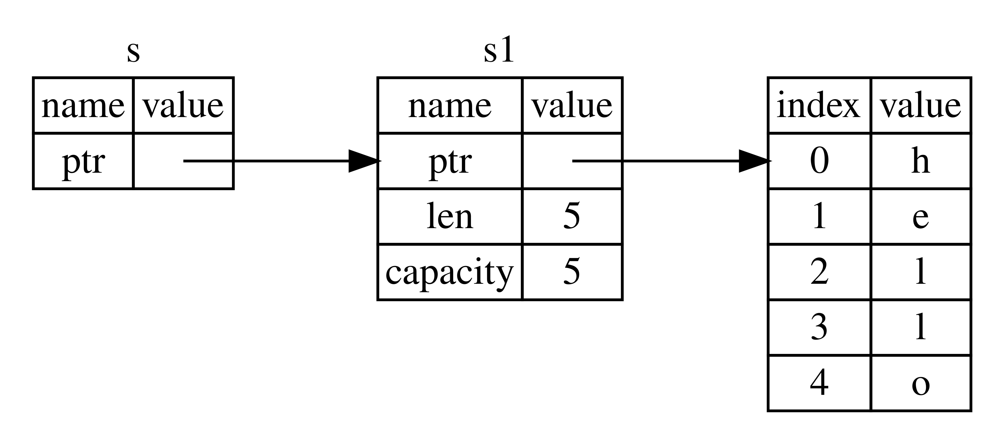

# References and Borrowing

 Unlike a pointer, a reference is guaranteed to point to a **valid** value of a particular type for the life of that reference

```rs
//Example 1- original value has to return to not loose the value and the ownership

//Return of multiple values using tuples-
fn main() {
    let s1 = String::from("hello");

    let (s2, len) = calculate_length(s1);

    println!("The length of '{}' is {}.", s2, len);
}

fn calculate_length(s: String) -> (String, usize) {
    let length = s.len(); // len() returns the length of a String
    (s, length)
}
```

```rs
//Example 2(Recommended)- Just passing the reference, hence the ownership is not passed as the parameter with it

fn main() {
    let s1 = String::from("hello");

    let len = calculate_length(&s1); //ownership has not been passed

    println!("The length of '{}' is {}.", s1, len); //hence, s1 is valid
}

fn calculate_length(s: &String) -> usize {
    s.len()
}// Here, s goes out of scope. But because it does not have ownership of what
  // it refers to, it is not dropped.
```


> We call this action of creating a reference- `Borrowing`. As in real life, if a person owns something, you can borrow it from them. When you’re done, you have to give it back. You don’t own it.

### Mutable and Immutable References
1. **Immutable References**
    ```rs
    fn main() {
        let s = String::from("hello");
        change(&s);
    }

    fn change(some_string: &String) {
        some_string.push_str(", world"); // cannot change the data, as some_string is an immutable ref
    }
    ```
    > **NOTE**: *We can have any number of immutable ref of a variable at any given time*

2. **Mutable References**
    ```rs
    fn main() {
        let mut s = String::from("hello");

        change(&mut s);
    }
    
    fn change(some_string: &mut String) {
        some_string.push_str(", world"); // now works fine
    }
    ```

    Mutable references has a **big restriction** restriction-  *if you have a mutable reference to a value, you can have no other references to that value*
    ```rs
    let mut s = String::from("hello");

    let r1 = &mut s;
    let r2 = &mut s; // it is not an error until r1 is accessed after this line (ofcourse Not recommended)

    //NOTE: first mutable ref (r1) is Only valid, before the creation of new reference of the same data (i.e r2)

    println!("{}, {}", r1, r2); // r2 is allowed, but r1 is not
    ```
    <br>
    Above same rule applies for combininig immutable and mutable ref at the same time

    ```rs
    let mut s = String::from("hello");

    let r1 = &s; // no problem
    let r2 = &s; // no problem
    let r3 = &mut s; // BIG PROBLEM, until the values of r1 and r2 is accessed after this line

    println!("{}, {}, and {}", r1, r2, r3); //only r3 is allowed

    ```
    The benefit of having this restriction is that Rust can **prevent data races at compile time**. A data race is similar to a race condition and happens when these three behaviors occur:

    - Two or more pointers access the same data at the same time.
    - At least one of the pointers is being used to write to the data.
    - There’s no mechanism being used to synchronize access to the data.

    **Rust refuses to compile, until the data races are fixed.**

    <br>
    As always, we can use curly brackets to create a new scope whenever required, allowing for multiple mutable references

    ```rs
    let mut s = String::from("hello");

    {
        let r1 = &mut s;
    } // r1 goes out of scope here, so we can make a new reference with no problems.

    let r2 = &mut s;
    ```

    #### Reference Scope-  
    Reference’s scope starts from where it is introduced and continues through the last time that reference is used
    ```rs
    let mut s = String::from("hello");

    let r1 = &s; // no problem
    let r2 = &s; // no problem
    println!("{} and {}", r1, r2);
    // variables r1 and r2 will not be used after this point

    let r3 = &mut s; // no problem
    println!("{}", r3);
    ```
    The scopes of the immutable references `r1` and `r2` end after the first `println!` where they are last used, before the mutable reference `r3` is created.  
    So, now we can create a new `mut` ref to the same varaible.

### Dangling References- 

The compiler guarantees that references will never be dangling references: if you have a reference to some data, the compiler will ensure that the data will not go out of scope before the reference to the data does.

<br>
Compile Time Error because of dangling reference

```rs
fn main() {
    let reference_to_nothing = dangle(); //dangling ref is not allowed
}

fn dangle() -> &String {
    let s = String::from("hello");

    &s
}// we return a reference to the String, s
 // Here, s goes out of scope, and is dropped. Its memory goes away.
  // Danger!!!
```
>**ERROR**, because this function's return type contains a borrowed value, but there is no value for it to be borrowed from **(Dangling Reference)**

## The Rules of References recap

- At any given time, you can have either one mutable reference or any number of immutable references.
- References must always be valid.
