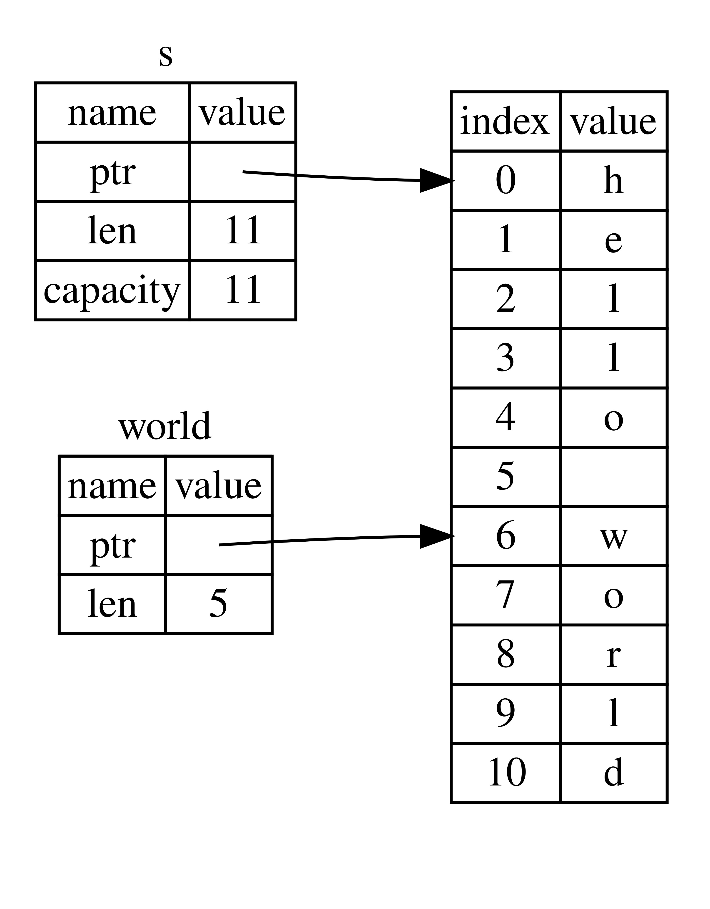

# String Slices

A string slice is a reference to part of a String
```rs
let s = String::from("hello world");
let hello = &s[0..5]; //or &s[..5]
let world = &s[6..11];//or &s[6..]
```



```rs
fn main() {
    let mut s = String::from("hello world");
    let word = first_word(&s);
    
    s.clear(); // error!
    
    println!("the first word is: {}", word);
}

//instead of returning just the index (so that later we can get the part of the string using the index), we can simply return the part of the slice using the string slice notation. 

//Benefit- Not only has Rust made our API easier to use, but it has also eliminated an entire class of errors at compile time!
fn first_word(s: &String) -> &str {
    let bytes = s.as_bytes();

    for (i, &item) in bytes.iter().enumerate() {
        if item == b' ' {
            return &s[0..i];
        }
    }
    &s[..]
}
```
## Advanced help from Rust Discord server. Keeping it for future reference-
Q. 
```rs
fn main() {
let mut s = String::from("helloworld");
let word = first_word(&s);
s.clear(); // why is this error?
println!("the first word is: {}", word); //try removing this line
}
fn first_word(_s: &String) -> &str {
    let a = "Aadarsh";
    &a[..] 
}
```
**Explanation-**   
because of 1st and 2nd lifetime ellision rule together, the fn signature gets converted to 
```rust
fn first_word<'a>(s: &'a String) -> &'a str
```
so, now the lifetime of `s` (&String) will live until the the `word` lives (in our case until the end of th program), but `s.clear()`(which is internally having the `&mut` of `s`) is conflicting with the rule that we cannot have `&` and `&mut` together (sidenote- we can have it together until the first ref is never used after the second), hence, we are getting an error
   
## String literals as Slices
```rs
let s = "Hello, world!"; //type of s here is &str, its a slice pointing to that specific point in binary, this is also why string literals are immutable; &str is an immutable ref
```
## String lilerals as parameters
```rs
fn first_word(s: &String) -> &str {
```
<br>
Better way is:

```rs
fn first_word(s: &str) -> &str {
```
If we have a string slice, we can pass that directly. If we have a `String` , we can pass a slice
of the `String` or a reference to the `String`.
This flexibility takes advantage of <u>*deref
coercions*</u>.

This approach makes our API more general and useful without losing any functionality.

```rs
fn main() {
    let my_string = String::from("hello world");

    // `first_word` works on slices of `String`s, whether partial or whole
    let word = first_word(&my_string[0..6]);
    let word = first_word(&my_string[..]);
    // `first_word` also works on references to `String`s, which are equivalent
    // to whole slices of `String`s
    let word = first_word(&my_string);

    let my_string_literal = "hello world";

    // `first_word` works on slices of string literals, whether partial or
    whole
    let word = first_word(&my_string_literal[0..6]);
    let word = first_word(&my_string_literal[..]);

    // Because string literals *are* string slices already,
    // this works too, without the slice syntax!
    let word = first_word(my_string_literal);
}
```

# Summary
##### The concepts of ownership, borrowing, and slices ensure memory safety in Rust programs at compile time.
